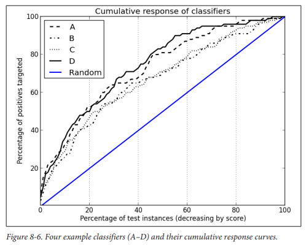

# [Data Science for Business: What You Need to Know About Data Mining and Data-Analytic Thinking](https://www.academia.edu/38731456/Data_Science_for_Business)

This book mainly covers case studies in Data Science across different business domains. It shows how DS can make an impact on business
and how data should be viewed as a business asset.

## Ch 1: Introduction to Data Analytic Thinking

Chapter 1: Introduction to Data Analytic Thinking
- The volume of data has surpassed the ability for statisticians and models to manually inspect data and derive insights. To address this Data Science has risen in popularity.
- Case Study 1: Hurricane Frances
    - Walmart utilizes DS to predict which items would be in demand for the hurricane. It came to counter-intuitive realizations that items such as strawberry PopTarts would be in demand. 
- Case Study 2: Customer Churn
    - MegaTelCo uses DS to identify which customers are likely to churn. By doing this they can target these customers with marketing campaigns. 
- Data Driven Decision Making (DDD) - The practice of basing decisions on the outcome of data analysis rather than intuition. A study on DDD @ MIT is covered to support its use. 
- Case Study 3: Target Pregnancy Predictions
    - Target and many other retailers compete to win the business of families which are welcoming new children. They know that children result in the buying habits changing (where you buy diapers is where you buy everything). Target had the realization that if it can predict *who* is pregnant, they can win their business before anyone even knows that the family has a new child. 
- For both case studies 1 & 3, the data is explored without a simple hypothesis with the hope that something useful can be uncovered. Case study 2 however has a basis hypothesis, predict who will churn. (Type 1 vs 2 DDD problems).
- Big Data 1.0 vs 2.0. First companies will learn how to process data (setup the plumbing). In 2.0, business will uncover all the different ways they can leverage this data.
- **Data should be viewed as a strategic asset** - Signet Bank to Capital One story. 
- Cross Industry Process for Data Mining (CRISP-DM).
- Data Science vs the Tools of Data Science (Analogy of how Chemists are not just the test tubes. Likewise Data Scienctists are not just Python, Pandas, Numpy etc. It is the science of discovering trends from data that is important)

## Ch 2: Business Problems and Data Science Solutions

Chapter 2: Business Problems in Data Science:
- Data mining is a *process* with fairly well defined stages
- “Each data driven business decision making problem is unique, comprising its own combination of goals, desires, constraints and even personalities. As with much engineering, though, there are sets of common tasks that underlie the business problems. In collaboration with business stakeholders, data scientists decompose a business problem into subtasks.”
- Types of problems:
    - “*Classification* and class *probability* *estimation* attempt to predict, for each individual in a population, which of a (small) set of classes this individual belongs to.”
        - Classes are usually mutually exclusive
        - Ex: Among all MegaTelCo customers, which are likely to response to a given offer? Classes are “will respond” and “will not respond”
        - Closely related tasks are *scoring* or class *probability estimation* (score representing the likelihood an individual belongs to a class)
        - Fundamentally predicts *whether* something will happen
    - Regression (*value estimation*)
        - “…estimate or predict, for each individual, the numerical value of some variable for that individual.
        - Ex: How much will a given customer use the service? What is the estimated income of an individual?
        - Fundamentally predicts *how much* something will happen
    - Similarity matching
        - *Identify* similar individuals based on data known about them
        - Ex: IBM wants to find companies similar to their best business customers in order to identify the best sales opportunities
        - This is the basis for one of the most popular methods for making product recommendations
        - Similarity measures underlie certain solutions to other data mining tasks such as classification, regression, and clustering. (Chapter 6)
    - Clustering
        - *Groups* individuals in a population together by their similarity, but not driven by any specific purpose
        - Ex: Do our customers naturally form groups or segments?
        - Useful in preliminary domain exploration to see which natural groups exist because these groups in turn may suggest other data mining tasks or approaches
        - Used as an input to decision making processes focus on questions like “What products should be offer or develop?”
    - Co-occurence grouping (frequent itemset mining, association rule discovery, and market basket analysis)
        - *Associations* between entities based on transactions involving them
        - Ex: What items are commonly purchased together?
        - Clustering vs co-occurence grouping:
            - Clustering looks at grouping between objects based on objects’ attributes
            - Co-occurence considers similarity of objects based on their appearing together in transactions
    - Profiling (behavior description)
        - Characterize behavior of an individual, group, or population
        - Ex: What is the typical cell phone usage of this customer segment?
        - Use case: Identify norms for anomoly detection applications like fraud detection
    - Link prediction
        - Predict connects between data items, usually by suggesting that a link should exist, and possibily also estimating the strength of the link
        - Common in social networking systems
        - Ex: You and Karen share 10 friends, maybe you want to be friends?
        - Can also estimate strength of a link
        - Forms basis of recommendation
    - Data reduction
        - Attempts to take a large set of data and replace it with a similar set of data that contains much of the important information in the larger set
        - Ex: A massive dataset on consumer viewing preferences may be reduced to a smaller one on consumer taste preferences
        - Involves loss of information. What is important is trade off for improved insight
    - Causal modeling
        - Attempts to help us understand what events or actions actually influence others
        - Ex: We use predictive modeling to target ads to consumers, and we observe the targeted consumers purchase at a higher rate. Was this because ads influenced consumer to purchase? Or did the model just predict who was going to buy anyways
        - Testing strategies include A/B tests/controlled experiments. Counterfactual analysis
        - ** In all cases a carful DS should always include with a causal conclusions the exact assumptions that must be made for it to hold
- Supervised vs unsupervised methods
    - Is a target being predicted? Then it is supervised
    - Supervised requires that there is data on the target available (how do you validate predictions without)
    - Supervised methods include classification, regression, causal modeling
    - Unsupervised methods include clustering, co-occurence grouping, profiling
    - Similarity matching, link prediction, and data reduction could be either
- Data Mining and Its Results
    - Mining data to find patterns and build models vs using the results
    - The latter is how the models are used in productions on new examples generally.
- Cross industry standard process for data mining (CRISP-DM)
- Business understanding
    - It is an iterative process to recast the problem statement and design a solution
    - The design team should first think carefully about the problem o be solved and the use case
- Data understanding
    - If solving the business problem is the goal, data comprises the available raw material to build the solution
    - Understand strengths/limitations of data. E.g. Historical data does generally not have the DS problem as its purpose for existence. Customer, transaction, and marketing DBs can contain difference information, intersection populations, and have varying reliability.
    - Data cost can be variable
    - Dataset might be missing data on your target variable
- Data preparation
    - Data type conversion (e.g. tabular)
    - Missing values
    - Data types
    - Normalization and scaling
    - Leaks (does data contain information on the target variable)
- Modeling
    - Preliminary stage where data mining techniques are applied to the data
    - Model or pattern capturing regularities of the data
- Evaluation
    - Assess data mining results rigorously and to gain confidence that they are valid and reliable before moving on
    - Ensure model satisfies original business goals e.g. does fraud detection solution produce too many false alarms (comprehensibility of the model through testing in prod like environment)
- Deployment
    - Put results of data mining into real world use
    - Increasing these are automated deployments of the data mining techniques. E.g. when new ad campaign is presented, systems are deployed that build and test models in production
        - Do this because the world is changing faster than the data science team can adapt or business has too many tasks for data science to handle
- Managing a Data Science Team
    - Do not think of CRISP-DM as the software engineering lifecycle. It is closer to research and development than engineering. It iterates on *approaches* and *strategy* rather than software designs. Outcomes are less certain and the findings from a step can. fundamentally change the understanding of the problem
    - “Engineering a data mining solution directly for deployment can be an expensive premature commitment. Instead … prepare to invest in information to reduce uncertainty”
        - Pilot studies
        - Throwaway prototypes
        - Review literature to see what else is done and how it has worked
- Other Analytics Techniques and Technologies
    - Statistics
        - Summary statistics vs the field of stats
    - Database Querying
        - SQL vs OLAP
    - Data Warehousing
        - Integration of distributed datasets (not always necessary)
    - Regression Analysis
    - Machine Learning and Data Mining
    - Answer business problems using the techniques/technologies outlined above. Refer to page 40-41

## Ch 3: Introduction to Predictive Modeling: From Correlation to Supervised Segmentation
Chapter 3: Introduction to Predictive Modeling: From Correlation to Supervised Segmentation
- "Fundamental concepts: Identifying informative attributes; Segmenting data by progressive attribute selection"
- Exemplary techniques: Finding correlations, Attribute/variable selection; Tree induction
- We think of predictive modeling as "Supervised Segmentation"-how can we segment the population into groups that differ from each  other with  respect to some quantity of interest. -> Segment in  terms of something we want to predict or estimate
- Target can be  cast negatively (something we want to prevent) or positively
- "information is a quantity  that reduces uncertainty about something"
- "Finding informative attributes  also is the basis for *tree induction*"
- Model accuracy vs intelligibility  trade off (Best model vs one that makes sense)
- Models, Induction and Prediction
    - "Supervised  learning is model creation where the model describes a relationship between a set of select  variables (attrs or features) and a predefined  variable called the target variable"
    - Model induction = creation of models from data
        - Induction is a term from philosophy "to generalize from specific cases to general rules"
        - Induction algorithm/learner = procedure which creates the model from data
- Supervised Segmentation
    - How can we judge if a variable contains important information about the target variable? How much?
        - One method is "direct, multivariate supervised segmentation" (in classification)
            - When segmenting, we would prefer "pure" segments (each instance in the segment have same val for target), in the real world its not realistic though ("homogenous w.r.t. target variable")
            - 1. Attrs rarely split a group purely.
            - 2. Is it better when a group splits more broadly or more purely?
            - 3. Not all attrs are binary. How do we compare  these?
            - 4. Can you segment numeric attrs?
            - You solve these questions using a *purity measure* for classification problems
            - Most common splitting criterion is *information gain*. It is based on a purity measure called *entropy* (Shannon, 1948)
            - Explanation of entropy and information gain (p 51-55)
            - Information gain is not the correct splitting criterion for regression, variance is better for numeric but is technically a purity measure
- Example: Attr Selection with Information Gain
    - Discusses using information gain to reduce the entropy of a mushroom dataset
- Supervised Segmentation with Tree Structured Models
    - Classification/decision trees (p 63). Similar concept to trees in programming. The leaf nodes represent the class to predict. The decision points descend based on information gain. The first one after the root gives your best information gain.
    - *"Tree induction"* - How to create a tree structured model
    - Advantages to trees:
        - Easy to understand, simple to describe, easy to use, robust to common data problems, relatively efficient
    - Goal of tree: "Partition instances based on their attrs into subgroups that havee similar values for their target variables"
    - "Divide and conquer approach" - create purest subgroups possible
    - When do you stop splitting? When there are no more variables or you chose to stop earlier (simpler tree, Chapter 5)
- Visualizing Segmentations
    - Visualize how a classification tree partitions the instance space
    - Common form of instance space visualization is the scatter plot (p 70)
- Trees as Sets of Rules
    - Trees can be interpreted as logical statements using IF AND THEN syntax (p 71)
- Probability Estimation
    - Sometimes we need a more informative prediction than classification. For example is one prediction a more strong yes/no than another? How likely is someone to churn? This is whree probability estimation comes in
    - We would like each "segment to be assigned an estimate of the probability of membership in the different classes" (p 72)
    - *probability estimation tree*
    - frequency based estimate of class membership probability (extends the previously built up example of segmenting with trees)
        - Can lead to overfitting when there are not many examples at a leaf node
        - You can use smoothing "*Laplace correction*", which moderates influence of leafs with few instances
- Example: Addressing the Churn Problem with Tree Induction
    - Before building the model, check how good each variable is independetly with information gain
    - Apply classification tree alg
    - Notice that the order of the tree decisions does not necessarily match the initial information gain rankings. This is because "Nodes in the clf tree depend on the instances abovee them in the tree"
    - When do you stop building the tree?
        - Generality and overfitting come in here (CH 5)
        - Stop before these happen
    - Now that we have a model and we test it on some data, do we trust it? This is where *model evaluation* comes in (CH 7/8)
- Summary (p 78/79)
    - Information Gain
    - Entropy
    - Feature Selection
    - Segmenting
    - Trees and their history/implmentations

## Ch 4: Fitting a Model to Data
- Fundamental concepts: finding optimal model parameters based on data. Choosing the goal for data mining (objective function, loss function)
- Exemplary techniques: Linear regression, logistic regression, support vector machines
- *Parameter learning* / *Parametric modeling*
    - A different approach to how we learned the supervised segmentation model. Instead of recursively splitting the instace space by finding informative attrs, we start by
        1. Specify structure of the model with certain param left unspecified
        2. Data mining calculates best param vaues given set of training data
        3. Params can be chosen by domain knowledge, or attr selection (ch 3 approach)
    - Fundamentally we chose the model and attrs and the goal of data mining is to tune the params so that the model fits the data best as possible without overfitting
    - An example of this are linear models
- Page 83-85 shows a great comparison between how trees versus linear models split the param space. Deicision trees get many horizontal/vertical "cuts", whereas the linear picks one but has the flexibility to draw horizontal, vertical, or a combination of the two (linear discriminant function). It can also be described as perpendicular cuts vs piecewise function (p 103)
    - Trees of rules versus numerical function
- Linear disciminant
    - The function of the decision boundary is a weighted sum of the attrs
    - P 88 shows that many linear boundaries can separate the groups of points. How do we best chose the line? This is where the objective function comes in
- Optimizing an Objective Function
    - The objective function represents our goal. We optimize the parameters to satisfy this goal. Therefore our parameters are only good if we truly believe the objective function represents what we want to achieve.
    - Finding a true representation is often impossible so we must rely on faith and experience
        - One is support vector machine
- An Example of Mining a Linear Discriminant from Data
    - P 89-91 shows how different models would fit the Iris dataset
- Linear Discriminant Functions for Scoring and Ranking Instances
    - Usually we dont want to just know whether an instance belongs to a class, we want to know *how likely* is belongs. One way to solve this is using the class probability estimation from Chapter 3 (prob from leaf nodes). There is another way with linear models.. logisitic regression
    - Another use case is targetted market (p. 91). We don't necessary need an exact probability like 0.123456, but a score will be good enough: 12.
- Support Vector Machines Briefly
    - SVM's objective function incorporates the idea that "wider is better."
    - We create a margin (p. 93) between the classes and try to optimize its width
    - It also has a method for understanding loss when instances fall on the wrong side of the line
    - Balance between margin width and low total error penalty
    - "Hinge loss"
- Regression
    - Regression has many possible objective functions, mean squared error, absolute error, etc. What do we want to penalize? Depends on business use case
- Class Probability Estimation and Logistic "Regression"
    - By chosing a different objective function for our linear model, we can build a model to provide accurate estimates of class probability. Most commonly we use logistic regression for this
    - Class probability estimates have a few considerations:
        - "Well calibrated" & "Discriminative" (p. 98)
    - Why use logistric reg instead of linear reg when determining class probability?
        - For linear reg, f(x) gives a range from -inf to inf distance from the separating boundary. Prob should range from 0-1
    - So how does log solve the infinity problem?
        - p. 98-99 outlines a correlary using log odds to describe probability
        - For log reg, let f(x) return the model's estimation of the log odds that x belongs to the positive class. Then we can use algebra to translate the log odds back to probability
    - Log reg is technically a class probability estimation model, not a regression model
- Example: Logistic Regression versus Tree Induction
    - Model explainability vs accuracy trade-off (p. 105-107)
- Nonlinear Functions, Support Vector Machines, and Neural Networks
    - Nonlinear SVMs and Neural networks are the most populat models that fit parameters of complex nonlinear funcs
    - Kernal functions (linear, polynomial, etc)
    - Explanation of Neural Nets as a stack of models (p 109)
        - Risk of fitting data too well
- Summary
    - Second type of predictive modeling technique called function fitting or parametric modeling
    - Linear reg
    - Log reg
    - SVM
    - Linear discriminants
    - Objective functions
    - Predictive perf vs intelligibility
    - Overfitting

## Chapter 5: Overfitting and Its Avoidance
- Fundamental concepts: Generalization, Fitting and overfitting, Complexity control
- Exemplary techniques: Cross-validation, Attribute selection, Tree pruning, Regularization
- Defines overfitting as "Finding chance occurences in data that look like interesting patterns, but which do not generalize well" (p. 111)
- Generalization
    - Defined as "The property of a model or modeling process, whereby the model applies to data that were not used to build the model." (p. 112).
    - We want the models to apply beyond the training dataset
- Overfitting
    - Defined as "The tendency of data mining procedures to tailor models to the training data, at the expense of generalization to previously unseen data points" (p. 113)
    - All data mining procedures have the tendency to overfit to some extend (some more than others)
    - "The answer is not to use a data mining procedure that doesn't overfit because all of them do. Nor is the answer to simply use models that produce less overfitting, because there is a fundamental trade-off between model complexity and the possibility of overfitting... The best strategy is to recognize overfitting and to manage complexity in a principled way." (p. 113)
- Overfitting Examined
    - Holdout Data and Fitting Graphs
        - Fitting graph shows the accuracy of a model as a function of complexity
        - To examine *overfitting*, we need to introduce a fundamental concept to evaluation in DS, *holdout* data
        - We hide certain instances from the model, get predictions on them, and compare against the hidden truth values
        - Shows on page 114 a fitting graph and the tradeoff between complexity, error rate, and holdout vs training data
    - Overfitting in Tree Induction
        - If you continually split nodes in the tree, eventually you will end up with a lookup table (perfectly accurate for training set)
        - This isn't ideal, but still not as bad as the previous example of an overfitted classifier, since even for new examples it will non-trivially give some prediction.
        - We can artifically limit the number of nodes to avoid overfitting
        - Page 117 shows the "sweet" spot when fitting for tree induction
    - Overfitting in Mathematical Functions
        - Mathematical fns can become more complex by adding more variables
        - This can give the modeling procedyre too much leeway to fit the training set
        - Manual feature selection where possible
- From Holdout Evaluation to Cross-Validation
    - Cross-validation is a more sophisticated technique for the holdout training and testing procedure (p. 126)
    - Computes mean and variance so that we can understand how performance is expected to vary across datasets
    - Makes better use of a limited dataset by computing its estimates across all the data (systematically swaps out samples for testing)
    - Split labeled dataset into k partitions called *folds* (usually 5-10)
    - Iterate training and testing k times in a particular way
        - Chose different fold as the test data each iteration
        - Produce a model (one estimate of generalization performance)
    - When it is done, we have used every example once for testing and k-1 times for training
    - Now you can estimate mean and std/var
- Learning Curves
    - Defined as "A plot of the generalization performance against the amount of training data" (p. 131).
    - Learning curves show generalization performance, whereas fitting graphs also shows performance on the training data plotting against model complexity.
    - Learning curves depend on the type of modeling procedure
        - Page 131-132 explains the difference of learning curves characteristics between logistic regression and tree induction
- Overfitting Avoidance and Complexity Control
    - "To avoid overfitting, we control the complexity of the models induced from the data" (p. 133).
    - Avoiding Overfitting with Tree Induction
        - Strategies to avoid overfitting:
            - Stop growing the tree before it gets to complex (limit splits)
            - Grow tree until it is too large, then "prune" it back, reducing its size
        - There are simple ways to complete these strategies:
            - Limit tree size by specifying min # of instances that must be present in a leaf
                - What threshold should be use?
                    - Use hypothesis testing (described in detail in p. 133)
            - Pruning
    - A General Method for Avoiding Overfitting
        - "More generally, if we have a collection of models with different complexities, we could choose the best simply by estimating the generalization performance of each" (p. 134)
        - "Nested holdout testing" and "Nested cross-vaalidation" is described pages 134-135
        - "Sequential forward selection" (SFS)
        - "Sequential backward elimination"
    - Avoiding Overfitting for Parameter Optimization
        - Feature selection can be used to ensure the correct set of model attributes is selected for linear models and also some non-linear models
        - *Regularization*: Instead of optimizing to fit the data, we optimize some combination of fit and simplicity. Models will be better if they fit the data better, but they will also be better if they are simpler
        - *ridge regression* and *lasso* (L1 vs L2 norm)
- Summary (p. 140)
    - Model complexity vs Overfitting
    - All models can overfit
    - Fitting graphs and learning curves
    - Cross-validation and holdout sets
    - Regularization

## Chapter 6: Similarity, Neighbors, and Clusters
- Fundamental concepts:
    - Calculating the simililarity of objects described by data
    - Using similarity for prediction
    - Clustering as similarity-based segmentation
- Similarity use cases (p. 141-142):
    - Retrieve similar things directly
        - Ex. IBM wants to find customers similar to their best customers
    - Classification and regression
    - Clustering
        - Ex. See if our customer base contains groups of similar customers and what these groups have in common
    - Reccomendations
        - Provide reccomendations of similar products or people ("Customers with your browsing history have also looked at...")
    - Reasoning from similar cases
        - Ex. A doctor reasons about a new difficult case by recalling a similar case
- Similarity and Distance
    - "Once an object can be represented as data, we can begin to talk more precisely about the similarity between objects, or alternatively the distance between objects" (p. 142)
    - Represent objects as a feature vector. The closer two objects are in the feature space, the more similar they are (For example use Euclidian Distance)
- Nearest Neighbor Reasoning
    - Now that we have a metric for computing distance between objects, we can apply it to the business use cases. This method is called nearest neighbors.
    - An example of computing similar scotches to Bunnahabhain is given (pretty funny).
- Nearest Neighbors for Predictive Modeling
    - "Combining functions" for calculating the target prediction based on a number of similar neighbors. i.e. how can we compute target of new example given 5 training samples which are similar to it? Should we average, take the majorty, etc?
    - Classification
        - Ex. Predict if customer will respond to credit card offer. We calculate distance of all training set, retreive top N, now what combining function should we use? Lets say that 2/3 training samples have a "Yes" value for target and 1/3 is "No". Should we chose majority? (p. 147)
    - Probability Estimation
        - Prob score gives more information than a Yes/No answer for targets. With the CLF example, we could use more data than just the 3 training samples to calculate probability estimation.
    - Regression
        - We could use the same distance calulation as in the CLF example, but use a stat like mean or median for generating a pred.
- How Many Neighbors and How Much Influence?
    - There is no simple answer. Odd number of neighbors can help break ties for majority votes and 2 class problems
    - Generally, the greater the k, the more the estimates are smoothed out among neighbors. For example lets say k=size of the dataset. Then you basically take a mean/median of the dataset if you're using those metrics, or always chose majority class if we're doing majority vote
    - *Weighted voting* and *similarity moderated voting* help us address how closer samples should influence more than distant ones
- Geometric Interpretation, Overfitting, and Complexity Control
    - The tendency of k=1 to overfit is discussed on page 152.
    - How do we choose k?
        - Cross validation and nested holdout testing can be performed on the training set for a variety of different sizes of k. We chose the one that performs best. Then we build a model from the whole training set and evaluate against holdout set
- Issues with KNN
    - Intelligibility
        - There are two aspects, the justification of a decision, and the intelligibility of the entire model
        - Justifying a decision can be done by presenting the neighbors used in the decision. Ex. "Viewers who liked XYZ also liked 123"
            - Note this is good enough for some use cases, but something like a mortgage application this would not be enough. 
        - What is more difficult is understanding what knowledge was mined from the training set (see p 155-156)
    - Dimensionality and domain knowledge
        - Feature selection and scaling are both important for KNN. You can also inject domain knowledge by tweaking the distance function manually if you think some features are more important. 
        - "The curse of dimensionality"
    - Computational Efficiency
        - Training the model is very cheap, you basically just build a database of the training set
        - At prediction time, we need to find the nearest neighbors. As the size of the training set becomes larger, the runtime explodes. Therefore KNN is impractical when a large training set AND sub 10ms prediction time is needed.
- Some Important Technical Details Relating to Similarity and Neighbors
    - Heterogeneous Attributes
        - Categorical variables must be encoded
        - Numerical variables have different scales and ranges
    - Page 158 - 161 covers other distance metrics
    - Page 162 - 163 covers other combining functions
- Clustering
    - Unsupervised segmentation, or more simply, clustering, is finding natural groupings in the data without a specific target
    - Hierarchical Clustering
        - Page 166 shows a dendrogram which shows the hierarchical clusters on an example dataset
        - "Linkage function" computes the distance between clusters
    - Nearest Neighbors Revisited: Clustering Around Centroids
        - *centroid* based clustering algorithms such as k-means is outlined from p 171 - 174
- Understanding the Results of Clustering
    - One way is to examine the names of the clusters and try to extract meaningful information about why the instances were clustered
    - Page 180-182 outlines another method, building a decision tree to classify the clusters
- Stepping Back - Solving a Business Problem Versus Data Exploration
    - Page 183-185 discuss how unsupervised learning and supervised learning can differ when applied to business problems. Unsupervised learning is often more exploratory, so it is important to connect insights from it to the business application.
- Summary
    - Similarity
    - Distance
    - Combining Function
    - KNN
    - Clustering
    - K Means

## Chapter 7: Decision Analytics Thinking I: What Makes a Good Model?
- Fundamental concepts (p. 187):
    - Careful consideration of what is desired from data science results
    - Expected value as a key evaluation framework
    - Consideration of appropriate comparative baselines
- Exemplary techniques (p. 187):
    - Evaluation metrics
    - Estimating cost and benefits
    - Calculating expected profit
    - Creating baseline methods for comparison
- Page 187 describes how it is often difficult to measure model success. There is no right metric for every use case. It is important to use analytic thinking when selecting evaluation metrics.
- Evaluating Classifiers (p. 188)
    - In Ch 5 we introduced the holdout set for measuring generalization performance. But we never mentioned by which metrics you should measure this
- Plain Accuracy and its Problems (p. 189)
    - Just measuring accuracy has problems dicussed by Provost and Fawcett (https://www.researchgate.net/profile/Tom-Fawcett/publication/2373067_The_Case_Against_Accuracy_Estimation_for_Comparing_Induction_Algorithms/links/0fcfd51088470286cf000000/The-Case-Against-Accuracy-Estimation-for-Comparing-Induction-Algorithms.pdf)
    - We can use confusion matrix to uncover those problems
- The Confusion Matrix (p. 189)
    - "Class Confusion" and the "Confusion Matrix"
- Problems with Unbalanced Classes (p. 190)
    - Evaluation using accuracy breaks down for unbalanced classes
- Problems with Unequal Cost and Benefits (p. 193)
    - Accuracy makes no distinctions in the errors. The reading provides examples of a false negative vs false positive in a cancer diagnosis resulting. False negative is a diagnosis that they do not have cancer, very bad. False positive means they get the diagnosis and take extra tests, not too bad.
- Generalizing Beyond Classification (p. 193)
    - The previous examples generalize beyond classification to show that it is really important what evaluation metric we select. You should not simply select a metric that you learned about in a class
- A Key Analytical Framework: Expected Value (p. 194)
    - Decomposes data analytic thinking into:
        1. The structure of the problem
        2. The elements of the analysis that can be extracted from the data
        3. The elements of the analysis that need to be acquired from other sources (like SMEs)
    - Expected value calculation is defined:
        - EV = p(o1) * v(o1) + p(o2) * v(o2) + ...
- Using Expected Value to Frame Classifier Use (p. 194)
    - An example is provided on pages 194/195 that shows how we will use a model based on the expected value calculation
- Using Expected Value to Frame Classifier Evaluation (p. 196)
    - Fig 7.2 is a great framing of how expected value fits into the larger picture of analysis
    - An example of the expeected profit calculation is shown. First, the confusion matrix is created. Then, the probabilities of each cell in the matrix is calculated. Next, cost and benefit matrix is calculated (p. 199). Finally, expected profit is calculated using both matrices
- Evaluation, Baseline Performance, and Implications for Investments in Data (p. 204)
    - We should find the baseline which models should be compared to
        - Some interesting examples from weather and fraud modeling are given on p. 205-207
        - Additionally classifier and regression baseline models are explained

## Chapter 8: Visualizing Model Performance
- Fundamental Concepts:
    - Visualization of model performance under different kinds of uncertainty
    - Consideration of what is desired from data mining results
- Exemplary techniques
    - Profit curves
    - Cumulative response curves
    - Lift curves
    - ROC curves
- It is often useful to present visualizations rather than calculations like the expected profit in the previous chapter
- Ranking Instead of Classifying
    - If you get predictions on a list of cases, you can sort/rank them and act upon only the strongest predictions. This strategy is used when you have budgets
- Profit Curves
    - These curves allow us to visualize how moving a threshholding value in a classifier changes the outcomes of how many positive and negative instances we get
    - First you rank the probabilities for all instances, and use the threshold to classify which are positive and negative instances
    - Fig 8.2 on Page 213 gives a great example of this
    - You can also apply budgets to this concept by finding the cost of each instance to determine the max # of instances you can select, and ranking your classifiers at that given point (p. 214)
    - 
- ROC Graphs and Curves
    - Profit curves are appropriate when you know the conditions under which a classifier will be used
        - Class priors: The population of pos and neg instances in the target population (base rate).
        - Costs and Benefits: Expected profit is sensitive to the relative levels of costs and beneifts for the different cells of the cost benefit matrix
    - If either of those conditions is unknown, you can use ROC Curves
    - Pages 216-218 discuss how to interpret the ROC curve results
    - Page 219 details "The Area under the ROC Cure (AUC)"
    - 
- Cumulative Response and Lift Curves
    - ROC curves are not always intuitive for business stakeholders. Other more intuitive visualizations include "cumulative response curve"
    - This visualization plots the hit rate
    -  
- Example: Churn
    - Pages 223 - 230 outline how to apply the concepts from this chapter to a case study
- Summary
    - "Appropiximate Statistical Tests for Comparing Supervised Classificaiton Learning Algorithms" and "Evaluating Learning Algorithms: A Classification Perspective" are reccomended as follow up resources

## Chapter 9: Evidence and Probabilities
- Fundamental concepts:
    - Explicit evidence combination with Bayes' Rule
    - Probabalistic reasoning via assumptions of conditional independence
- Exemplary techniques
    - Naive Bayes classification
    - Evidence lift
- Example: Targeting Online Customers with Advertisements
    - A case study of online advertisements is presented. Browser cookies are used for the target variable to know whether someone purchased a hotel after seeing the ads. The other features are which ads a user has seen.
- Combining Evidence Probabilistically
    - The issues with trying to find a probability that any customer in the previously outlined case study will buy a hotel is discussed. Namely, "any" customer is really hard since we likely only have a small number of labels to train on. And these labels will not describe all possible customers. So we start by building evidence on specific customers, and try to extend it to all customers afterwards.
- Joint Probability and Independence
    - "Joint probability" i.e. p(AB)
    - If we know p(A) and p(B), we know the joint prob when A and B are independent
- Bayes' Rule
    - We can compute the prob of hypothesis H given some evidence E by looking at the prob of E given H, as well as the unconditional prob of H and E
- Applying Bayes' Rule to Data Science
    - Bayes' is applied to the case of classification on pages 239/240
- Conditional Independence and Naive Bayes
    - Naive Bayes equation is built expanding upon Bayes' Rule using conditional probabilities
- Advantages and Disadvantages of Naive Bayes
    - Advantages include its simplicity as a baseline classifier. Drawbacks are that it assumes independence
- A Model of Evidence "Lift"
    - Lift is applied to Naive Bayes. Essentially each feature will represent a lift or lower to the chance of an instance being a class
- Example: Evidence Lifts from Facebook "Likes"
    - A paper published in "Proceedings of the National Academy of Sciences" on Facebook likes is outlined
    - Each topic that people like can have a lift on whether they are high IQ, for instance
- Summary
    - A new family of methods turn around the discriminant line of models. Linear discriminants ask "What is the best way to distinguish target values." These new models ask "How do different target segments generate feature values" (Which class most likely created this piece of data)
    - These are called Bayesian methods
    - Naive Bayes classifier is provided as an example model
    - Certain Bayesian methods have independence assumptions which can allow us to compute evidence lift (If you like LOTR you are 69% more likely to have high IQ)
