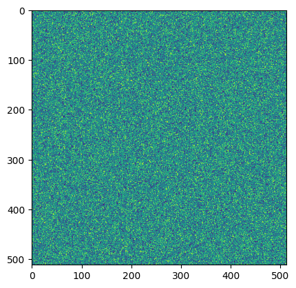

# Table of Contents

1. Overview, and Data and Uncertainty
    - Data Science Overview
        - [Patterns, Predictions and Actions](1_patterns_predictions_and_actions.md)
            - Chapter 1 - Introduction
            - Chapter 2 - Fundamentals of Prediction
        - [Elementary Statistics](2_elementary_statistics.md)
            - Chapter 1.1 - Stats key concepts
    - Data and Uncertainty
        - [Deep Learning](3_deep_learning.md)
            - Chapter 3.1 - Why Probability?
        - [Mathematics for Machine Learning](4_mathematics_for_machine_learning.md)
            - Page 6 - Table of Symbols
            - Chapter 2.2 - Matrices
2. Sampling and Descriptive Statistics
    - Descriptive Statistics
        - [Statistical Thinking](https://www.youtube.com/playlist?list=PLRKtJ4IpxJpBxX2S9wXJUhB1_ha3ADFpF)
        - [Density Curves: Modeling Data Distributions](https://www.youtube.com/watch?v=PUvUQMQ7xQk)
        - [Mean, Median and Skew from Density Curves](https://www.youtube.com/watch?v=JFesFhraX2M)
        - [Mathematics for Machine Learning](4_mathematics_for_machine_learning.md)
            - Chapter 6.4
        - [MatPlotLib Histograms](https://matplotlib.org/stable/plot_types/stats/hist_plot.html)
        - [Applied Linear Algebra](6_applied_linear_algebra_intro.md)
            - Chapter 3.3 - Standard Deviation
        - Key concepts:
            - Descriptive stats
            - Variance
            - Standard deviation
            - Quantiles
            - Skew
    - Resampling Data
        - [Bootstrapping Main Ideas](https://www.youtube.com/watch?v=Xz0x-8-cgaQ)
        - [The Danger of Overfitting](youtube.com/watch?v=Ux3X97nfHSE&list=PLRKtJ4IpxJpDxl0NTvNYQWKCYzHNuy2xG&index=50)
        - [The Importance of Data Spliting](https://www.youtube.com/watch?v=L5rA1MsGXtA&list=PLRKtJ4IpxJpDxl0NTvNYQWKCYzHNuy2xG&index=52)
3. What Models Do and Managing Model Errors
    - What do Models do?
        - [Mathematics for Machine Learning](4_mathematics_for_machine_learning.md)
            - Chapter 8 - 8.1 - Matrices
        - [Applied Linear Algebra](6_applied_linear_algebra_intro.md)
            - Chapter 2.1 - Linear Functions
    - Managing Errors
        - [Mathematics for Machine Learning](4_mathematics_for_machine_learning.md)
            - Chapter 9 - 9.1 - Linear Regression
        - [Principles of Risk Minimization for Learning Theory - Vladimir Vapnik](https://proceedings.neurips.cc/paper_files/paper/1991/hash/ff4d5fbbafdf976cfdc032e3bde78de5-Abstract.html)
            - Describes the function estimation model
            - A good youtube video to accompany this is: https://www.youtube.com/watch?v=Ow25mjFjSmg
        - [Deep Learning](3_deep_learning.md)
            - Chapter 4.3 -  Gradient Based Optimization
        - [R-squared or coefficient of determination | Regression | Probability and Statistics | Khan Academy](https://www.youtube.com/watch?v=lng4ZgConCM)
        - [Measuring the fit of a regression model: R^2](https://mcrovella.github.io/DS701-Tools-for-Data-Science/17-Regression-I-Linear.html#measuring-the-fit-of-a-regression-model-r-2)
        - [Statistical Forecasting: Notes on Regression and Time Series Analysis, What’s a Good Value for R-Squared?](https://people.duke.edu/~rnau/rsquared.htm)
    - Ordinary Least Squares Regression
        - [Linear Models](https://mcrovella.github.io/DS701-Tools-for-Data-Science/17-Regression-I-Linear.html)
            - Covers concepts like Design matrix (independent vars, matrix X), Observation matrix (dependent vars, vector y), Parameter vector (model params), Observed vs predicted, Residuals, Least squares line (minimizes the sum of the squares of the risiduals), Regression coefficients, Multiple regression, R^2
        - [Mathematics for Machine Learning](4_mathematics_for_machine_learning.md)
            - Chapter 9 - 9.2.2 - Linear Regression. Finish the rest of this section that wasn't covered in Managing Errors section
4. Fitting Models to Data
    - Model Parameter Fiting
        - Key concepts:
            - Parameters of decision trees vs linear regression
    - Calculating Gradients
        - [Derivatives at Wolfram Mathworld](https://mathworld.wolfram.com/Derivative.html)
        - [The paradox of the derivative](https://www.youtube.com/watch?feature=shared&v=9vKqVkMQHKk)
        - [Derivatives through geometry](https://www.youtube.com/watch?v=S0_qX4VJhMQ)
        - Key concepts:
            - Gradients
            - Limits (one and two sized)
            - Differentiability
            - Derivative
                - Partial derivatives
                - Derivatives of Linear Functions of One Variable
                - Partial Derivatives of a Linear Function with Multiple Variables
                - Derivatives of Constants
                - Derivatives of Variables
                - Derivatives of Sums
                - Derivatives of Scaled Functions
                - Rules for Combining Derivative Expressions
                - Derivatives of Common Functions
            - Extrema
                - Zero Gradients and Local Extrema
                - Local Extrema Without Zero Gradients
                - Convex Functions
            - Polynomials
                - Polynomial Gradients and Linear Regressions
                - Deriving the Derivative of a Monomial
                - Derivatives of a Polynomial
            - Deriving the Minimum Loss Parameters of a Linear Model
5. Introduction to Random Variables
    - Introduction to Random Variables
        - [Mathematics for Machine Learning](4_mathematics_for_machine_learning.md)
            - Chapter 6-6.1: Probability and Distributions
        - Key concepts:
            - Probability Distribution
            - Entropy
            - Perplexity
            - Sample Distribution 
            - Sample Probability
            - Resampling
            - Mean of a Probability Distribution
            - Variance of a Probability Distribution
    - Boolean Random Variables
        - [Mathematics for Machine Learning](4_mathematics_for_machine_learning.md)
            - Chapter 6.2-6.2.1: Discrete and Continuous Probabilities
        - Key concepts:
            - Bernoulli Distributions
            - Uniform Random Numbers
            - Sampling Boolean Random Variables
            - Modeling Boolean Random Variables
            - Calculating Sample Distributions From True Probabilities
    - Continuous Random Variables
        - [Mathematics for Machine Learning](4_mathematics_for_machine_learning.md)
            - Finish the rest of Chapter 6.2
            - Chapter 6.5: Gaussian Distributions
        - Key concepts:
            - Boolean vs Continuous Random Variables
            - Probability Density Functions
            - Gaussian Distribution
            - Standard Normal Distribution
            - Calculating Means From Probability Density Functions
            - Calculating Variances From Probability Density Functions
            - Cumulative Distribution Function
            - Sampling Continuous Distributions
6. Relationship Between Random Variables
    - Marginal and Conditional Probabilities
        - [Mathematics for Machine Learning](4_mathematics_for_machine_learning.md)
            - Chapter 6.3: Sum Rule, Product Rule, and Bayes' Theorem
        - [Bayes' Theorem Proof](https://www.youtube.com/watch?v=U_85TaXbeIo)
        - Key concepts:
            - Univariate, bivariate and multivariate distributions
            - Marginal and Conditional distibutions on ndarrays and DataFrames
            - Conditional Distributions
                - 
            - Bayes' Theorem
                - 
            - Conditional Probability Density Functions  
    - Independence and Correlation
        - [Mathematics for Machine Learning](4_mathematics_for_machine_learning.md)
            - Chapter 6.4: Summary Statistics and Independence
        - Key concepts:
            - Independent Boolean Random Variables
                - 
            - Chained Dependencies and Potential Fallacies
            - Correlations Between Random Variables
                - Pearson's Correlation Coefficient
            - Sums of Random Variables
                - How it applies to independent vs correlated normally distributed variables
7. The Law of Large Numbers, Central Limit Theorem, and Hypothesis Testing
    - Central Limit Theorem
        - [Intro to Limits](https://www.youtube.com/watch?feature=shared&v=poBobcFn1Co)
        - [Law of Large Numbers - Khan Academy](https://www.youtube.com/watch?v=VpuN8vCQ--M)
        - [Why we gamble like monkeys (correlary to law of large numbers)](https://www.bbc.com/future/article/20150127-why-we-gamble-like-monkeys)
        - [Gambler's Fallacy](https://www.youtube.com/watch?v=XA_0OMJjkxQ)
        - Key concepts:
            - Reading limit notation
            - Finite vs Infinite Limits
            - The Law of Large Numbers
    - Hypothesis Testing
        - [Patterns Predictions and Actions Chapter 2 (Errors and ROC curves)](1_patterns_predictions_and_actions.md)
        - [Type I vs II Errors](https://www.youtube.com/watch?v=SBt7q2m_Ncw)
        - [Classification: ROC Curves and AUC](https://developers.google.com/machine-learning/crash-course/classification/roc-and-auc)
        - [Elementary Stats - Chapter 1.4.1, 4.2 (except 4.2.2)](2_elementary_statistics.md)
        - [Statistical tests, P values, confidence intervals, and power: a guide to misinterpretations](https://link.springer.com/article/10.1007/s10654-016-0149-3)
        - [What is a p-value](https://www.youtube.com/watch?v=9jW9G8MO4PQ&list=PLRKtJ4IpxJpDsOT_8YDREJrO8cQUtPUVg&index=10&pp=iAQB)
        - [How do you get a p value?](https://www.youtube.com/watch?v=9jW9G8MO4PQ&list=PLRKtJ4IpxJpDsOT_8YDREJrO8cQUtPUVg&index=10&pp=iAQB)
        - [How to use p-values and significance levels](https://www.youtube.com/watch?v=lJSTfhkB5zw&list=PLRKtJ4IpxJpDsOT_8YDREJrO8cQUtPUVg&index=12&pp=iAQB)
        - [The Problem of Multiple Comparisons](https://www.youtube.com/watch?v=HpjlcEH4zuY)
        - Key concepts:
            - Errors (Type I and II)
            - ROC Curves
            - AUC
            - P Values, Confidence Intervals, and Power
            - Signifiance Levels in relation to P Values
            - The Problem of Multiple Comparisons
8. Motivations for Linear Algebra
    - Why Linear Algebra
        - [Math for ML - Chapter 2: Linear Algebra (Up to 2.2)](4_mathematics_for_machine_learning.md)
        - [Vectors | Chapter 1, Essence of linear algebra](https://www.youtube.com/watch?v=fNk_zzaMoSs&list=PLZHQObOWTQDPD3MizzM2xVFitgF8hE_ab)
        - [Math for ML - Chapter 7.3.1: Linear Programming](4_mathematics_for_machine_learning.md)
        - Key concepts:
            - How Linear algrebra is used in ML
    - Principle Components Analysis
        - [Mathematics of Machine Learning, Chapter 10-10.2 Dimensionality Reduction with Principal Components Analysis](4_mathematics_for_machine_learning.md)
        - [Principal Component Analysis](https://www.youtube.com/watch?v=FD4DeN81ODY)
        - Key concepts:
            - PCA as identifies common directions of variation in a dataset
9. Introduction to Vectors
    - Basic Vectors Concepts
        - [Vector Equations](https://mcrovella.github.io/CS132-Geometric-Algorithms/L04VectorEquations.html)
        - [Mathematics of Machine Learning, Chapter 2-2.1 Linear Algebra](4_mathematics_for_machine_learning.md)
        - [Introduction to Applied Linear Algebra, Chapters 1-1.3](6_applied_linear_algebra_intro.md)
        - [Introduction to Applied Linear Algebra, Chapters 3.1: Norm](6_applied_linear_algebra_intro.md)
        - [Introduction to Applied Linear Algebra, Chapters 3.2: Distance](6_applied_linear_algebra_intro.md)
    - Vector Similarity Measures
        - [Introduction to Applied Linear Algebra, Chapter 5.1: Linear Dependence](6_applied_linear_algebra_intro.md)
        - [Mathematics for Machine Learning, Chapter 2.5: Linear Independence](4_mathematics_for_machine_learning.md)
10. Introduction to Matrices
    - Basic Matrix Concepts
        - [Mathematics of Machine Learning, Chapter 2.2 Matrices](4_mathematics_for_machine_learning.md)
        - [Introduction to Applied Linear Algebra, Chapters 6: Matrices](6_applied_linear_algebra_intro.md)
        - [CS132 Lecture Notes: Linear Transformations](https://mcrovella.github.io/CS132-Geometric-Algorithms/L07LinearTransformations.html)
        - [CS132 Lecture Notes: The Matrix of a Linear Transformation](https://mcrovella.github.io/CS132-Geometric-Algorithms/L08MatrixofLinearTranformation.html)
        - [CS132 Lecture Notes: The Inverse of a Matrix](https://mcrovella.github.io/CS132-Geometric-Algorithms/L10MatrixInverse.html)
        - [CS132 Lecture Notes: Eigenvectors and Eigenvalues](https://mcrovella.github.io/CS132-Geometric-Algorithms/L16Eigenvectors.html)
        - [Mathematics of Machine Learning, Chapter 4.2 Eigenvectors and Eigenvalues](4_mathematics_for_machine_learning.md)
        - Personal Reccomendations:
            - [3Blue1Brown - Linear Algebra](https://www.youtube.com/playlist?list=PLZHQObOWTQDPD3MizzM2xVFitgF8hE_ab)
        - Key concepts:
            - Square Matrix
            - Matrix Diagonal vs Diagonal Matrix
            - Matrix Trace
            - Matrix Transposition
            - Symmetric matrix
            - Matrix Arithmetic
            - Zero Matrix
            - Describe matrices in terms of numbers and dimensions
            - Matrix/scalar and matrix/matrix operations including addition and multiplication
            - Recognize problems including linear regression that can be formulated as vector or matrix multiplication problems
    - Matrix Row Operations
        - [CS132 Lecture Notes: Gaussian Elimination](https://mcrovella.github.io/CS132-Geometric-Algorithms/L03RowReductions.html)
        - Key concepts:
            - Invertability of matrix row operations
            - Tracking row operations via extra columns
            - Use row operations in the context of matrix equations 
            - Explain matrix ranks and how they limit the use of matrices
            - Explain when to use Gaussian elimination
11. Systems of Linear Equations
    - Linear Equations
        - [Mathematics of Machine Learning, Chapter 2.1 Systems of Linear Equations](4_mathematics_for_machine_learning.md)
        - [Introduction to Applied Linear Algebra, Chapters 8: Linear Equations](6_applied_linear_algebra_intro.md)
        - [Mathematics of Machine Learning, Chapter 2.2.4 Compact Representations of Systems of Linear Equations](4_mathematics_for_machine_learning.md)
        - [Mathematics of Machine Learning, Chapter 2.3 Solving Systems of Linear Equations](4_mathematics_for_machine_learning.md)
        - [Solving linear systems by substitution | Algebra Basics | Khan Academy](https://www.youtube.com/watch?v=V7H1oUHXPkg)
        - [Gaussian Elimination](https://www.youtube.com/watch?v=1IHsX1lgpRI)
        - [Mathematics of Machine Learning, Chapter 2.5 Linear Independence]
        (4_mathematics_for_machine_learning.md)
        - [Introduction to Applied Linear Algebra, Chapters 11.3: Solving Systems of Linear Equations](6_applied_linear_algebra_intro.md)
        - [Inverse Matrices and Matrix Equations](https://www.youtube.com/watch?v=a2S0kuXO3gE)
        - Key concepts:
            - Solve linear equations with one or two variables by hand
            - Use row operations in the context of systems of linear equations
            - Explain the basic conditions for linear independence
            - Check if a pair of equations or matrix rows is collinear
            - Confirm a row is linearly dependent given the asserted coefficients
            - Solve small systems of linear equations with Gaussian elimination and back substitution
            - Solve linear equations with NumPy
12. Vector Spaces
    - [Subspaces](https://mcrovella.github.io/CS132-Geometric-Algorithms/L14Subspaces.html)
    - [Mathematics of Machine Learning, Chapter 2.4 Vector Spaces](4_mathematics_for_machine_learning.md)
    - [Mathematics of Machine Learning, Chapter 2.6 Basis and Rank](4_mathematics_for_machine_learning.md)
    - [What is a Vector Space?](https://www.youtube.com/watch?v=ozwodzD5bJM)
    - [Dimension and Rank](https://mcrovella.github.io/CS132-Geometric-Algorithms/L15DimensionRank.html)
    - [Introduction to Applied Linear Algebra, Chapters 5.2: Bases](6_applied_linear_algebra_intro.md)
    - [Mathematics of Machine Learning, Chapter 2.7 Linear Mappings](4_mathematics_for_machine_learning.md)
    - [Orthogonal Sets and Projection](https://mcrovella.github.io/CS132-Geometric-Algorithms/L21OrthogonalSets.html)
    - [Introduction to Applied Linear Algebra, Chapters 5.4: Gram Schmidt Algo](6_applied_linear_algebra_intro.md)
    - [Mathematics of Machine Learning, Chapter 3.5 Orthonormal Bases](4_mathematics_for_machine_learning.md)
    - [Mathematics of Machine Learning, Chapter 3.4 Angles and Orthogonality](4_mathematics_for_machine_learning.md)
    - [Orthogonal Matrices Preserve Angles and Lengths](https://www.youtube.com/watch?v=yDwIfYjKEeo)
    - [Mathematics of Machine Learning, Chapter 3.8 Orthogonal Projections](4_mathematics_for_machine_learning.md)
    - [Mathematics of Machine Learning, Chapter 8.4.3 Latent Variable Models](4_mathematics_for_machine_learning.md)
    - [Angles for Manifold Learning (Up to Section 3)](https://www.lcayton.com/resexam.pdf)
    - Key concepts:
        - Vector space: an algebraic structure with a non-empty set of elements along with a vector addition operator and a scalar multiplication function
        - Linear subspace: a vector space contained within another vector space
        - Generating set: a set of elements that can generate any element of a vector space using linear combinations
        - Linear span: a vector space generated by a particular set of elements
        - Basis of vector space: a minimal generating set for a particular vector space
        - Dimension of vector space: the size of a basis for a particular vector space
        - Coordinates: a (usually) smaller vector describing elements of a vector space as a linear combination of a particular basis
        - Orthogonal basis: a basis whose elements are orthogonal
        - Orthonormal basis: an orthogonal basis whose elements are also unit vectors
        - Projection: an idempotent linear transform of a vector space
13. Linear Dimensionality Reductions
    - Linear Dimensionality Reductions
        - [What is dimensionality reduction?](https://www.ibm.com/think/topics/dimensionality-reduction)
        - [Curse of Dimensionality – A “Curse” to Machine Learning](https://towardsdatascience.com/curse-of-dimensionality-a-curse-to-machine-learning-c122ee33bfeb/)
        - [The Curse of Dimensionality](https://www.youtube.com/watch?v=oTSj0TTDSPI)
        - [Terence Tao slides, Compressed Sensing, Or: The Equation Ax=b](https://www.math.hkbu.edu.hk/~ttang/UsefulCollections/compressed-sensing1.pdf)
        - [IBM Topics: What Is Linear Discriminant Analysis (LDA)](https://www.ibm.com/topics/linear-discriminant-analysis)
    - Principal Components Analysis
        - [Dimensionality Reduction and PCA – SVD II](https://mcrovella.github.io/DS701-Tools-for-Data-Science/11-Dimensionality-Reduction-SVD-II.html)
        - [Mathematics of Machine Learning, Chapter 10-10.2 Dimensionality Reduction with PCA](4_mathematics_for_machine_learning.md)
        - [Mathematics of Machine Learning, Chapter 10.3 Projection Perspective](4_mathematics_for_machine_learning.md)
        - [Mathematics of Machine Learning, Chapter 10.7 Latent Variable Perspective](4_mathematics_for_machine_learning.md)
        - [Least Squares as Springs](https://joshualoftus.com/posts/2020-11-23-least-squares-as-springs/least-squares-as-springs.html)
        - [Mathematics of Machine Learning, Chapter 10.6 Key Steps of PCA in Practice](4_mathematics_for_machine_learning.md)
    - Key concepts:
        - Explain the benefits of dimensionality reductions for feature creation, computation, and visualization
        - Define linear dimensionality reductions using matrices 
        - Implement random projections for dimensionality reduction
        - Explain principal components analysis as a change of basis 
        - Explain principal components analysis as a linear dimensionality reduction 
        - Explain principal components analysis as lossy compression
14. Course Wrap Up
    - Linear Methods in a Nonlinear World
        - Big Data is Often Approximately Low Rank
            - Modern datasets are exploding in size. Numer.ai produced a dataset in 2021 with over 1,000 features and 2 million rows. GPT-3.5 was trained on 570GB of data, over 2,000 features and 400 billion rows
            - Random matrices have high expected rank (very unlikely for rows to be dependent due to randomness)
            - 
            - Most high dimensional datasets have a low dimensional structure that we call a manifold
            - Most work in data science has a manifold structure of lower dimension than the number of columns
            - 
            - Low rank approximations of matrices can be identified using approaches like PCA. 
            - [Why are Big Data Matrices Approximately Low Rank?](https://arxiv.org/abs/1705.07474)
            - [Journal of Cognitive Neuroscience, Eigenfaces for Recognition](https://www.face-rec.org/algorithms/PCA/jcn.pdf) shows that faces have low dimensional representations
            - [The Bell System Technical Journal, C.E. Shannon, Prediction and Entropy of Printed English](https://ieeexplore.ieee.org/document/6773263)
            - [Super Massive Data Release: Deep Dive](https://forum.numer.ai/t/super-massive-data-release-deep-dive/4053)
        - Loss Functions and Gradient Descent
            - Newton's Method and Gradient Descent are methods for function minimization
            - [Derivatives… What?](https://www.youtube.com/watch?v=-ktrtzYVk_I)
            - [Visually Explained: Newton’s Method in Optimization](https://www.youtube.com/watch?v=W7S94pq5Xuo)
            - [Gradient Descent in 3 Minutes](https://www.youtube.com/watch?v=qg4PchTECck)
    - Beyond Linear Methods
        - Natural Encodings of Data
            - There are often encodings of data that make it easier to reason about and simulate. For example, in a GPS you do not often need x/y/z coorindates, you just need x/y.
            - [Representing Scenes as Neural Radiance Fields for View Synthesis](https://www.matthewtancik.com/nerf)
        - Latent Codes and Auto Encoders
            - Auto encoders define encode/decode functions that allow you to move data to/from latent code (approximate the initial data). For example image encoding/decoding or PCA
            - Recent advancements in latent codes:
                - [StyleGAN2](https://arxiv.org/abs/1912.04958) 2019 (this person does not exist website) creates faces, but was pretty slow
                - [Denoising Diffusion Probabilistic Models](https://arxiv.org/abs/2006.11239) in 2020 described progress in diffusion probabalistic models for removing noise from images. They were able to start from images of entirely noise, and derive an image from it. Although this model was very slow
                - [High Resolution Image Synthesis with Latent Diffusion Models](https://arxiv.org/abs/2112.10752) found a worthwhile tradeoff of quality for speed
                - [Reducing the Dimensionality of Data With Neural Networks](https://www.cs.toronto.edu/~hinton/absps/science.pdf)
        - Fantastic Methods and When to Use Them
            - In the next class, DX603 Machine Learning Fundamentals, we will discuss more types of models
            - Linear Model Variants
                - Ordinary least squares, Ridge regression, LASSO, ElasticNet
            - Polynomial Regression (more flexible than Linear models)
            - Decision Trees (very interpretable)
            - Ensembles (increase flexibility by combining results of models)
            - Decision Forest (utilize lots of decision trees to increase performance)
            - Gradient Boosted Trees (fix mistakes)
    - Key concepts:
        - Recognize applications of linear methods beyond explicitly linear cases
        - Explain the advantages of a small and concise encoding of data
        - Preview upcoming modeling topics
