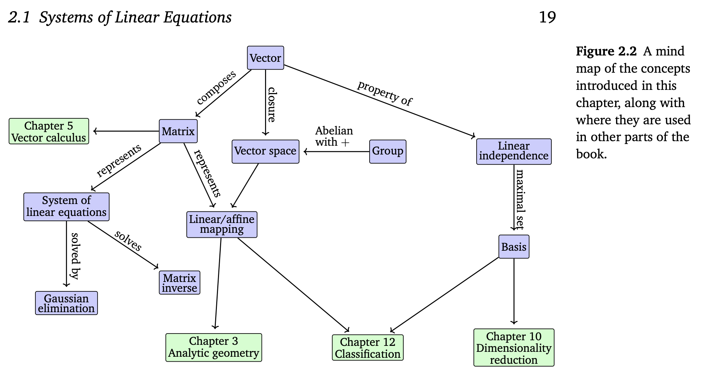

# [Mathematics for Machine Learning](https://mml-book.github.io/book/mml-book.pdf)

## Chapter 2: Linear Algebra
- "Linear algebra is the study of vectors and certain algebra rules to manipulate vectors" (p. 17)
- Discusses what can be considered as vectors (Numbers, polynomials, audio, and tuples)
- 
### Section 1: Systems of Linear Equations
- "Many problems can be formulated as systems of linear equations, and linear algebra gives us the tools for solving them" (p. 19)
- "In general, for a real-valued system of linear equations we obtain either no, exactly one, or infinitely many solutions. Linear regression (Chapter 9) solves a version of Example 2.1 when we cannot solve the system of linear equations" (p. 21)
### Section 2: Matrices
- Matrices "...compactly represent systems of linear equations, but they also represent linear functions (linear mappings)" (p 22).
- Provides definitions of matrices, matrix sums and dot products on page 22-23
- Differentiates the dot product with Hadamard product (element wise)
- Matrix sums requires matrices are same dimensions
- Dot product requires that matrices are of sizes ab and bc respectively. It is not commutative (AB != BA)
- Provides some properties of matrices
    - Associativity, Distributivity, Mult with Identity Matrix
- Inverse 
    - Not every matrix has an inverse.  If this inverse does exist, A is called regular/invertible/nonsingular, otherwise singular/noninvertible. 
    - A^-1 is the notation
- Transpose
    - A^T is the notation
- Multiplication by scalar
- Systems of equations as matrices
### Section 5: Linear Independence
- A basis is a set of vectors with which we can represent every vector in the vector space by adding them together and scaling them
- A linear combination is an expression formed by multiplying each of a set of vectors by a scalar (a constant number) and then adding the results together
- A set of linearly independent vectors consists of vectors that have no redundancy, i.e., if we remove any of those vectors from the set, we will lose something

## Chapter 4: Matrix Decompositions
### Section 2: Eigenvectors and Eigenvalues
- "Every linear mapping has a unique transformation matrix given an ordered basis" (p. 105)
- Eigenvalues tell us how the eigenvectors are transformed by the linear mapping
- Two vectors that point in the same direction are codirected
- Vectors that point in the same or opposite direction are collinear
- This section also discusses properties and characteristics of eigenvectors and eigenvalues

## Chapter 6: Probability and Distributions
- This reading introduces the ideas of probability, and particularly spends time on the interpretation of probabilities.
- Quantifying uncertainty requires the idea of a random variable, which is a function that maps outcomes of random experiments to a set of properties that we are interested in
- Associated with the random variable is a function that measures the probability that a particular outcome (or set of outcomes) will occur; this is called the probability distribution
- Prob distributions are the foundation of probabilistic modeling, graphical models, and model selection
- To define the probability space, we will discuss the following topics:
    - The sample space
    - The events
    - The probability of an event
### Section 1
- Bayesian vs Frequentist probability
- Probability space allows us to quantity the idea of a probability
- Random variables
- The sample space Ω:
    - The set of all possible outcomes of the experiment, sample space usually denoted by Ω. For example, two successive coin tosses have a sample space of {hh, tt, ht, th}, where “h” denotes “heads” and “t” denotes “tails”.
- The event space A:
    - The event space is the space of potential results of the experiment. A event space subset A of the sample space Ω is in the event space A if at the end of the experiment we can observe whether a particular outcome ω ∈ Ω is in A. The event space A is obtained by considering the collection of subsets of Ω, and for discrete probability distributions (Section 6.2.1) A is often the power set of Ω.
- The probability P
    - With each event A ∈ A, we associate a number P(A) that measures the probability or degree of belief that the event will occur. P(A) is called the probability of A.
- Target space
    - Basically the possible results from the random variable
- "Probability theory and statistics are often presented together, but they concern different aspects of uncertainty"
    - Using probability, we can consider a model of some process, where the underlying uncertainty is captured by random variables, and we use the rules of probability to derive what happens
    - In statistics, we observe that something has happened and try to figure out the underlying process that explains the observations.
    - ML is closer to statistics in that we try to fit a model to that adequately represents the process that generated the data. However, the analysis of future inputs uses concepts from probability & stats
#### Section 2
- When target space is discrete, you can imagine the prob dist of multiple random vars as a 2d array (cartesian product of each random vars target space) (joint probability)
- Marginal and conditional probability
- Probability density function (pdf) vs cumulative distribution function (cdf)
#### Section 3
- Provides definitions of joint, marginal, and conditional distributions
- Summarizes that there are only two fundamental rules in relation to these distributions, the sum and product rules.
- Sum rule definitions (one in case of discrete and one for continuous y)
    - *marginalization property*
    - Used in Bayes' theorem
- Product rule definition
    - Used in Bayes' theorem
- We use Bayes' theorem to draw conclusions about *x* given the observed values of *y*
    - Sometimes called *probabilistic inverse*
- Relation of Bayes' theorem to the definitions of *prior*, *likelihood*, *posterior*, and *marginal likelihood/evidence*
#### Section 4
- Means and Covariances
    - Mean and (co)variance are often useful to describe properties of probability distributions (expected values and spread). We will see in Section 6.6 that there is a useful family of distributions (called the exponential family), where the statistics of the random variable capture all possible information.
- Expected Value: "The expected value serves as a fundamental concept to evaluate models, frame problems, and guide decision-making within a business context by using the Expected Value Framework to quantify potential costs and benefits of a model's probabilistic predictions."
- Median
    - For distributions, which are asymmetric or have long tails, the median provides an estimate of a typical value that is closer to human intuition than the mean value
    - More robust to outliers than mean
- Mean
- Mode
- Covariance
- Variance
- Standard Deviation
- Correlation
- Population vs Sample

## Chapter 7: Continuous Optimization
### Section 3.1: Linear Programming
- This section talks about convex optimization problems where the functions are linear

## Chapter 8: When Models Meet Data
### Section 1: Data, Models and Learning
- Data as Vectors
    - Discusses how data should be tabular usually, where each row represents a vector of features or attributes
    - Definitions for vectors of features (xn) and targets (y)
    - *feature maps* can represent xn in a higher dimensional representation 
    - *kernal* -> feature map leads to kernal (CH 12)
- Models as Functions
    - Once data is in vector representation, we can construct a predictor
    - Predictor as a function vs a probabalisitic model (p 261)
    - "A predictor is a function that, when given a particular input example (in our case, a vector of features), produces an output. For now, consider the output to be a single number, i.e., a real-valued scalar output. This can be written as f : R^D → R, where the input vector x is D-dimensional (has D features), and the function f then applied to it (written as f(x)) returns a real number
    - We use the linear function case: f(x) = (θ^⊤)x + θ0 for unknown θ and θ0
- Models as Probability Distributions
    - "how to use concepts from probability (Chapter 6) to define machine learning models in Section 8.4, and introduce a graphical language for describing probabilistic models in a compact way in Section 8.5."
- Learning is Finding Parameters
    - "The goal of learning is to find a model and its corresponding parameters such that the resulting predictor will perform well on unseen data. There are conceptually three distinct algorithmic phases when discussing machine learning algorithms:"
        - 1. Prediction or inference
        - 2. Training or parameter estimation
        - 3. Hyperparameter tuning or model selection
    - "The prediction phase is when we use a trained predictor on previously unseen test data"
    - "When we have a probabilistic model (discussed further in Section 8.4) the prediction phase is called inference"
    - "Remark. Unfortunately, there is no agreed upon naming for the different algorithmic phases. The word “inference” is sometimes also used to mean parameter estimation of a probabilistic model, and less often may be also used to mean prediction for non-probabilistic models."
    - The training or parameter estimation phase is when we adjust our predictive model based on training data
        - Stategies are finding the best predictor based on some measure of quality (sometimes called finding a point estimate), or using Bayesian inference
    - For the non-probabilistic model, we follow the principle of empirical risk empirical risk minimization
        - Maximum likelihood
    - *cross validation* - how to  simulate the behavior of our predictor on future unseen data
    - *abduction* - trade off between fitting well on training data and finding “simple” explanations of the phenomenon
    - *hyperparameter*
    - *model selection* 
    - *nested cross validation* - For non-probabilistic models, model selection is often done using this method

## Chapter 9: Linear Regression
- This chapter motivates linear regression from the problem of modeling noisy data, presenting the same linear regression formula as a maximum likelihood solution.
### Section 0
- Outlines the goal of regression and some applications including time series, robotics, etc.
- How do you find a regression function?
    - Model type choice
    - Finding good parameters
    - Handling overfitting and model selection
    - Relationship between loss fn and parameter priors
    - Uncertainty modeling
### Section 1
- Describes problem formulation, how we solve for noise etc
### Section 2 (until 9.2.2)
- How do we find good parameters?
- Maximum Likelihood Estimation
- Overfitting
- Maximum A Posteriori

## Chapter 10: Dimensionality Reduction with Principal Component Analysis
- "Dimensionality reduction exploits structure and correlation and allows us to work with a more compact representation of the data, ideally without losing information" (p. 317)
- "principal component analysis (PCA), is an algorithm for linear dimensionality reduction. PCA, proposed by Pearson (1901) and Hotelling (1933), has been around for more than 100 years and is still one of the most commonly used techniques for data compression and data visualization. It is also used for the identification of simple patterns, latent factors, and structures of high-dimensional data." (p. 317).
### Section 1: Problem Setting
- Sets the scene for the problem statement. Essentially we have multi dimension data and would like some way to compress the data without losing too much information (*minimize the compression loss*). This is where PCA comes in
### Section 2: Maximum Variance Perspective
- "If we interpret information content in the data as how “space filling” the dataset is, then we can describe the information contained in the data by looking at the spread of the data. From Section 6.4.1, we know that the variance is an indicator of the spread of the data, and we can derive PCA as a dimensionality reduction algorithm that maximizes the variance in the low-dimensional representation of the data to retain as much information as possible. Figure 10.4 illustrates this" (p. 320).
